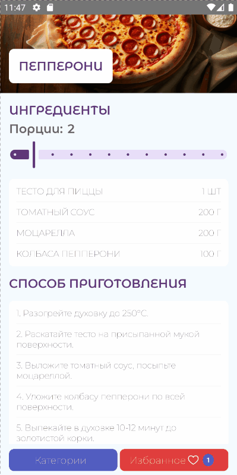

# RecipeCompApp

[](https://github.com/vkozhanova/RecipeCompApp/actions/workflows/ci.yml)
Android-приложение для просмотра рецептов, разработанное с использованием Jetpack Compose и современных компонентов Android Jetpack.
## Возможности
- Просмотр категорий рецептов
- Просмотр списка рецептов
- Просмотр подробной информации
- Добавление рецептов в избранное
- Локальное сохранение избранного
- Загрузка данных из удалённого API
## Demo
<table>
<tr>
<td align="center"><b>Categories</b></td>
<td align="center"><b>Details</b></td>
</tr>
<tr>
<td></td>
<td></td>
</tr>
</table>

## Реализовано
- современный UI на Jetpack Compose;
- разделение приложения по принципу MVVM;
- офлайн-кэширование данных;
- сохранение избранных рецептов;
- работа с REST API;
- автоматическое внедрение зависимостей;
- автоматическая сборка и тестирование через GitHub Actions
## Технологии
- Kotlin
- Jetpack Compose
- Material 3
- Coroutines + Flow
- Hilt
- Navigation Compose
- Retrofit
- Kotlinx Serialization
- Room
- DataStore
- Coil
## Архитектура
Проект построен по архитектуре MVVM с разделением ответственности между слоями UI, ViewModel и Repository.
```
UI (Compose)
      │
ViewModel
      │
Repository
      │
────────────────────────────
Remote API (Retrofit)
Local Database (Room)
DataStore
```
Для упрощения поддержки и масштабирования код разделён на feature-пакеты по функциональным областям:
```
features/
    categories/
    recipes/
    details/
    favorites/
```
## Структура проекта
```
app
├── core
├── data
├── di
├── features
│   ├── bottom
│   ├── recipes
│   ├── details
│   ├── favorites
│   └── categories
└── ui
```
## Тестирование
Покрытие кода собирается с использованием **JaCoCo**.
###  В проекте реализованы:
- Unit-тесты
- Instrumentation-тесты
- UI-тесты Jetpack Compose

  Используемые инструменты:
- JaCoCo
- Hilt Testing
- Kaspresso
## CI
Для проекта настроен GitHub Actions.
При каждом push и pull request автоматически выполняются:
- сборка проекта;
- запуск unit- и instrumentation-тестов;
- генерация отчёта покрытия JaCoCo;
- проверка успешности сборки.
## Запуск проекта
1. Клонируйте репозиторий:
```bash
git clone https://github.com/vkozhanova/RecipeCompApp.git
```
2. Откройте проект в Android Studio.
3. Дождитесь синхронизации Gradle.
4. Запустите приложение на эмуляторе или физическом устройстве.
---
## Автор
**Vera Kozhanova**

GitHub: [@vkozhanova](https://github.com/vkozhanova)