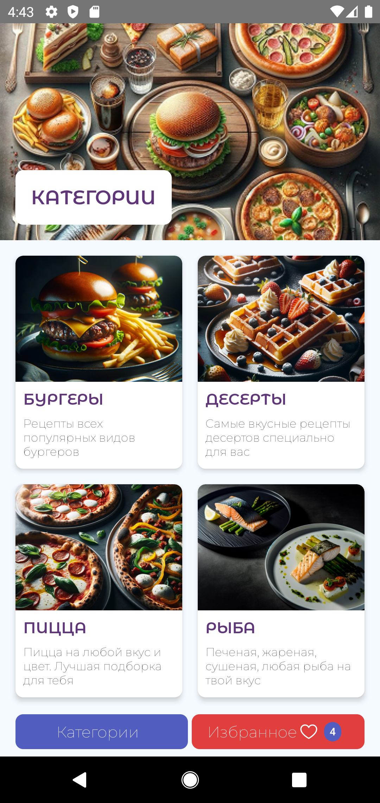
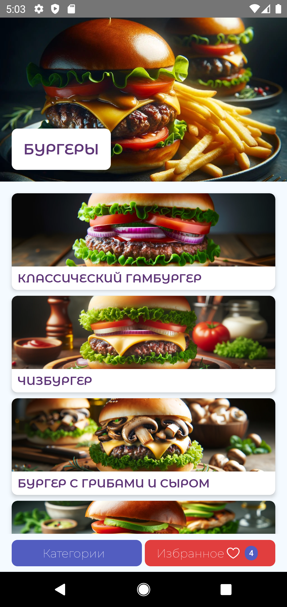
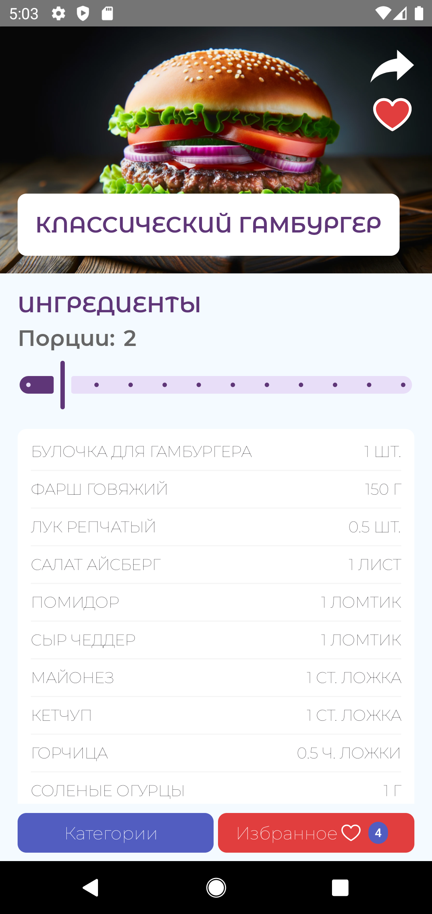
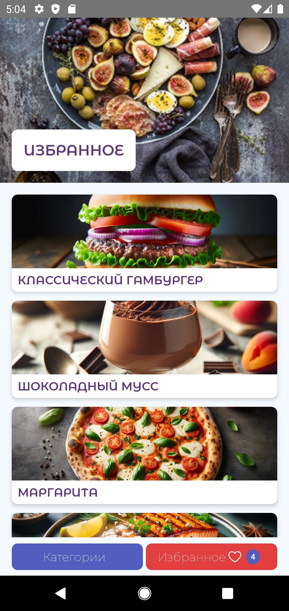
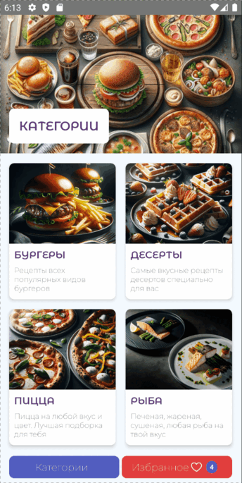

# RecipeCompApp

[](https://github.com/vkozhanova/RecipeCompApp/actions/workflows/ci.yml)
Android-приложение для просмотра рецептов
## Возможности
- Просмотр списка рецептов
- Просмотр рецептов по категориям
- Детальная информация о рецепте
- Добавление и удаление избранных рецептов
- Локальное сохранение данных
- Работа с удалённым API
- Современный интерфейс на Jetpack Compose
## Скриншоты
<table>
<tr>
<td align="center"><b>Categories</b></td>
<td align="center"><b>Recipes</b></td>
<td align="center"><b>Details</b></td>
<td align="center"><b>Favorites</b></td>
</tr>

<tr>
<td></td>
<td></td>
<td></td>
<td></td>
</tr>

<tr>
<td></td>
<td></td>
<td></td>
<td></td>
</tr>
</table>
## Что было реализовано
- современный UI на Jetpack Compose;
- архитектура MVVM;
- внедрение зависимостей через Hilt;
- локальное хранение данных в Room;
- хранение пользовательских настроек в DataStore;
- получение данных по сети через Retrofit;
- навигация Navigation Compose;
- автоматическая сборка через GitHub Actions;
- автоматические тесты и отчёты покрытия кода.
## Технологии
- Kotlin
- Jetpack Compose
- Material 3
- MVVM
- Repository Pattern
- Hilt (Dependency Injection)
- Retrofit
- Kotlinx Serialization
- Room
- DataStore
- Navigation Compose
- Coil
- Coroutines + Flow
## Архитектура
Проект разделён на слои:
```
UI (Compose)
      │
ViewModel
      │
Repository
      │
────────────────────────────
Remote API (Retrofit)
Local Database (Room)
DataStore
```
Для упрощения поддержки и масштабирования, каждая функциональность вынесена в отдельный feature-модуль по пакетам:
```
features/
    categories/
    recipes/
    details/
    favorites/
```
## Структура проекта
```
app
├── core
│   ├── navigation
│   └── ui
├── data
│   ├── database
│   ├── network
│   ├── local
│   ├── repository
│   └── model
├── di
├── features
│   ├── categories
│   ├── recipes
│   ├── details
│   └── favorites
└── ui
```
## Тестирование
Покрытие кода собирается с использованием **JaCoCo**.
###  В проекте реализованы:
- Unit-тесты
- Instrumentation-тесты
- Интеграционные тесты
- UI-тесты Jetpack Compose
- End-to-End тесты
- Hilt Test
- Kaspresso
## CI
Для проекта настроен GitHub Actions.
При каждом push и pull request автоматически выполняются:
- сборка проекта;
- запуск тестов;
- проверка успешности сборки.
---
## Автор
**Vera Kozhanova**

GitHub: https://github.com/vkozhanova